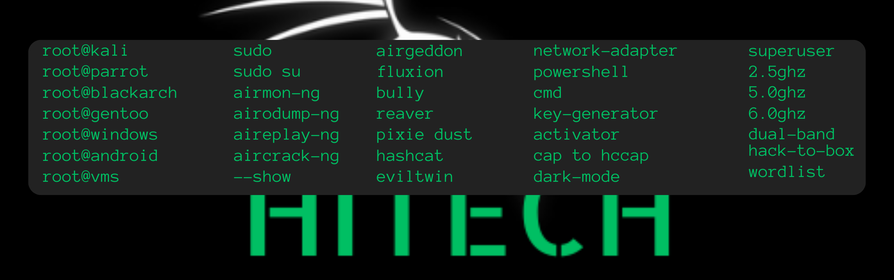

<h1 align="center">Assalamualaikum 👋,</h1>
<h3 align="center">A normal person and a servant of Allah S.W.T</h3>

 
  
 
<!--   -->

  

- 🔭 I’m currently working on **How To Master Your Mindset**

- 🌱 I’m currently learning **A Lot Of Things**

- 👨‍💻 Believe and keep learning. InsyaAllah you will see the results.

- 💬 Share your knowledge together we exchange our idea's.

- 📫 How to reach me **haikalhitech@gmail.com**

- 📄 Any projects are for educational purposes only, I'm not supporting any illegal actions taken by the brainless person.

- ⚡ **THE QUITER YOU BECOME, THE MORE YOU ARE ABLE TO HEAR**

 
<h3 align="left">Languages and Tools:</h3>

- Backend

  

- Frontend

  

- Database

  

- Cloud Servers

  

- Tools

  

 

<h3 align="left">Basic Knowledge</h3>

 

 All Rights Reserved™ ©® by <a href="https://github.com/hyekalhitech/GitTest">Hyekal HiTech</a>
